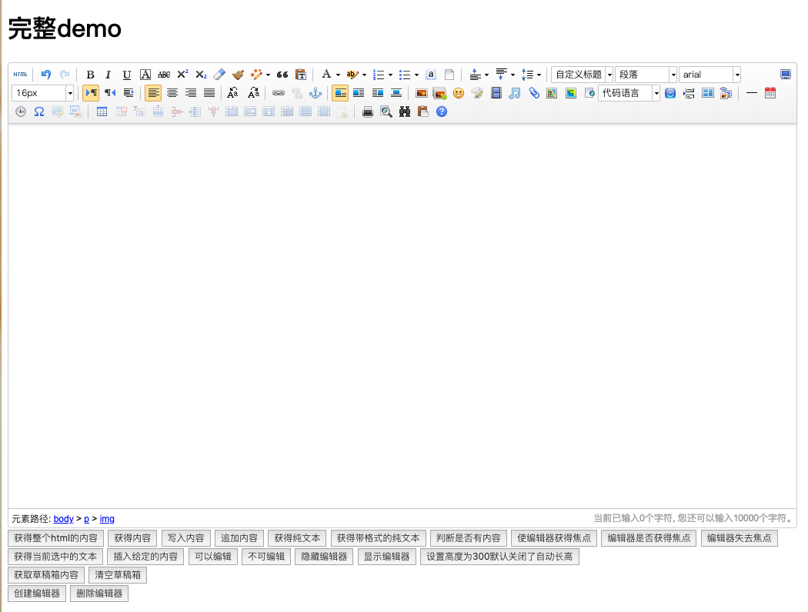

## 特性
- [x] 本地拖拽上传图片
- [x] 点击按钮上传图片、附件、视频
- [x] 查看并使用已上传图片列表

## 引导
### 安装依赖
```
cd server && npm i
```

### 开发
```
npm run dev
```

### 访问

demo路径为：`http://localhost:3000/ueditor`

## 实现步骤
### 构建最新版本ueditor
由于官网停止维护，前端资源不是最新的，因此我们通过clone主仓库，并手动构建出最新的前端版本：
```sh
git clone git@github.com:fex-team/ueditor.git
cd ueditor && npm i && npx grunt default
```

这里我们将打包好的`/dist/utf8-php`目录放入静态资源文件夹重命名为`ueditor`，然后在前端中引入即可。

### 静态资源服务
在根目录建一个静态资源文件夹`static`，通过koa-static进行服务：
```
app.use(serve(path.join(__dirname, 'static')));
```

然后将第一步构建出的资源文件存入`/static/ueditor`，这时即可通过服务访问挂载在静态资源中的网页：

### 编写后端服务
核心代码请参考`modules/ueditor`，完善中。
